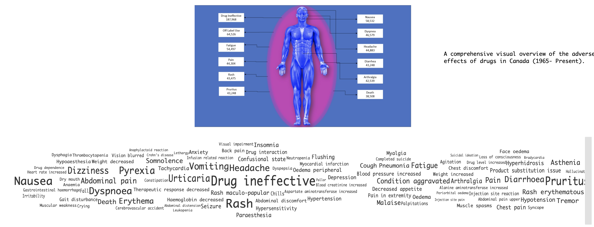
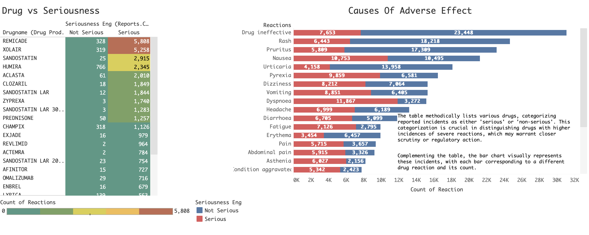
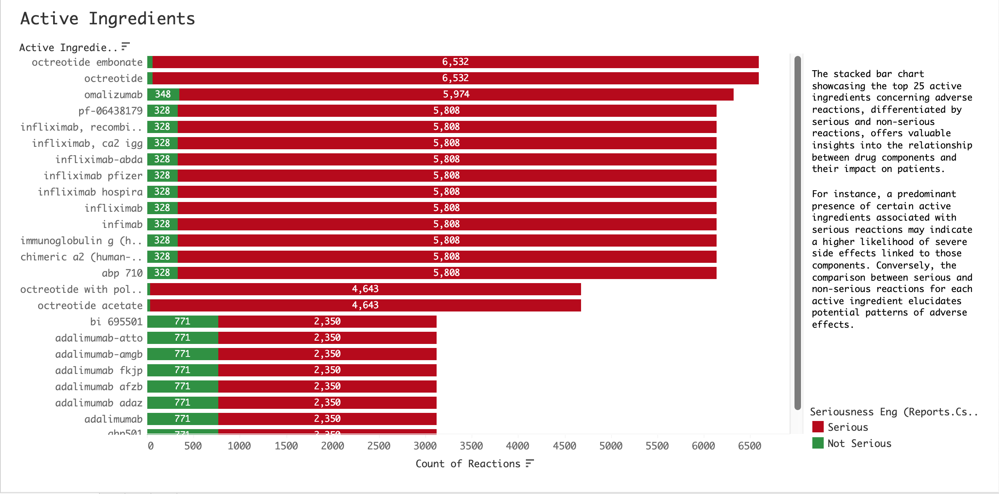
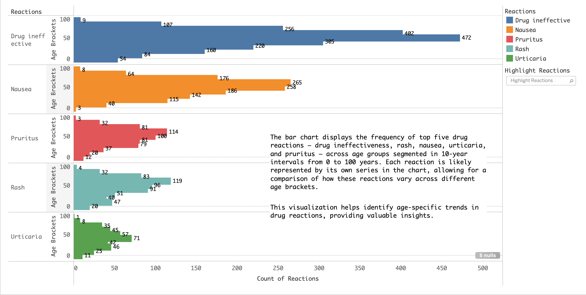
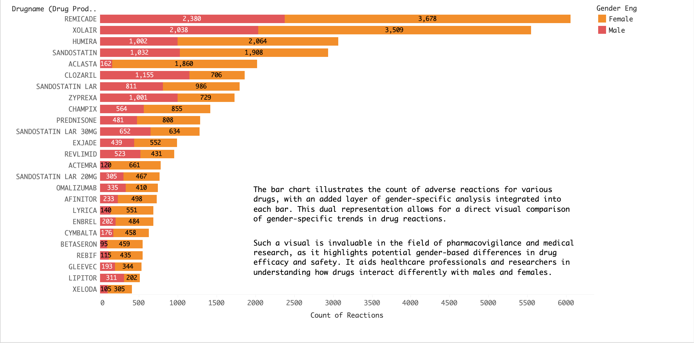
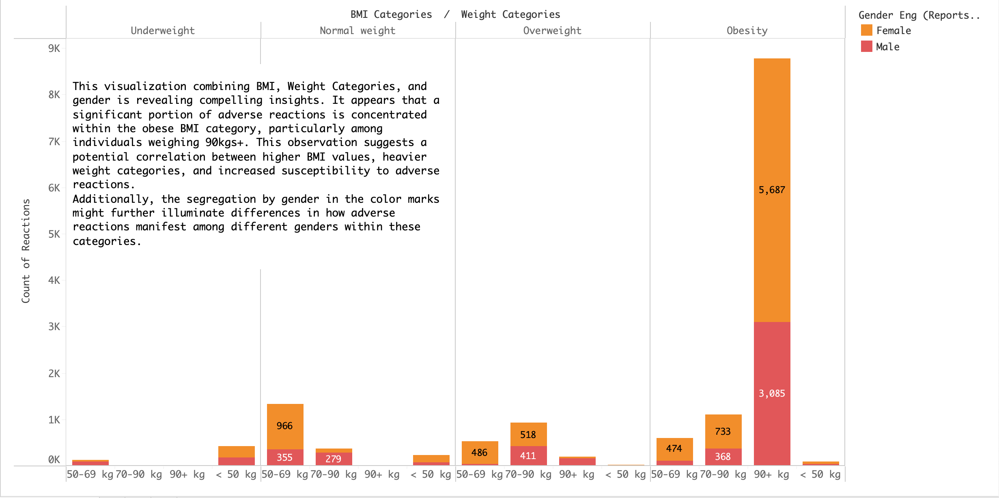
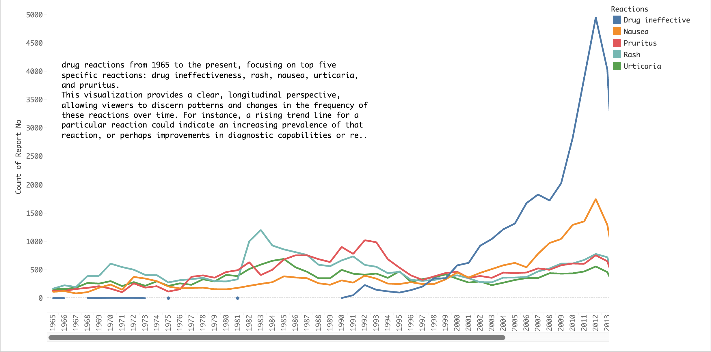
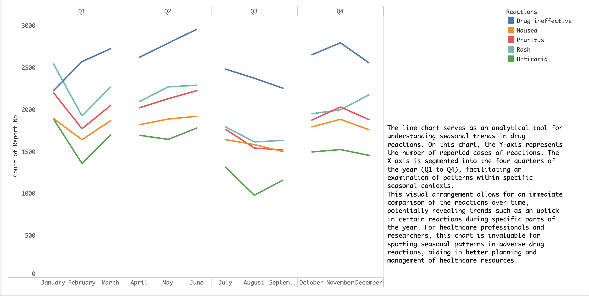

# Charting Medication Risks - Canada's Adverse Effects Data

## Overview
The Tableau story "Charting Medication Risks: Canada's Adverse Effects Data" is a comprehensive exploration of adverse drug reactions in Canada from 1965 to the present. This story provides valuable insights into critical aspects such as drug reactions, efficacy, active ingredients, age-wise and gender-based analyses, correlation with weight and BMI, temporal shifts, and seasonal variations.

## Story Points

### 1. Snapshot of Drug Reactions: The 50 Most Serious Cases
- **Description:** A visual overview of the 50 most serious adverse drug reactions in Canada, highlighting significant incidents and case studies.
- Word Cloud Visualization:
Created a word cloud showcasing the top 50 adverse reactions by reaction count, offering a quick and intuitive overview of prevalent drug risks.

### 2. Drug Efficacy and Adverse Event Profile
- **Description:** A methodical table categorizing reported incidents as 'serious' or 'non-serious,' complemented by a bar chart visualizing incidents for each drug reaction.

### 3. Active Agents: Profiling the Top 25 Ingredients
- **Description:** A stacked bar chart showcasing the top 25 active ingredients concerning adverse reactions, differentiating between serious and non-serious cases.

### 4. Age-Wise Analysis: Top 5 Adverse Drug Effects
- **Description:** A bar chart displaying the frequency of top five drug reactions across age groups, providing insights into age-specific trends.

### 5. Dissecting Drug Reactions by Gender
- **Description:** A bar chart illustrating adverse reactions for various drugs with a gender-specific analysis integrated into each bar, highlighting potential gender-based differences in drug efficacy and safety.

### 6. Reaction by Weight and BMI categories for Gender
- **Description:** A visualization combining BMI, weight categories, and gender to reveal insights into the correlation between drug reactions, body weight, BMI, and gender.

### 7. Temporal Shifts in Drug Safety: Top 5 Adverse Effects Annually
- **Description:** A line chart offering a longitudinal study of drug safety, analyzing changes in the top five adverse effects from 1965 to the present.

### 8. Seasonal Analysis: Top 5 Adverse Drug Effects
- **Description:** A line chart examining seasonal variations in adverse drug effects, facilitating an immediate comparison of reactions over the four quarters of the year.

## Conclusion
This Tableau story provides healthcare professionals, researchers, and regulators with a dynamic tool to explore and understand the complex landscape of adverse drug reactions in Canada. The integration of various visualizations offers valuable insights into critical factors affecting drug safety, enabling informed decision-making and improved healthcare resource management.
