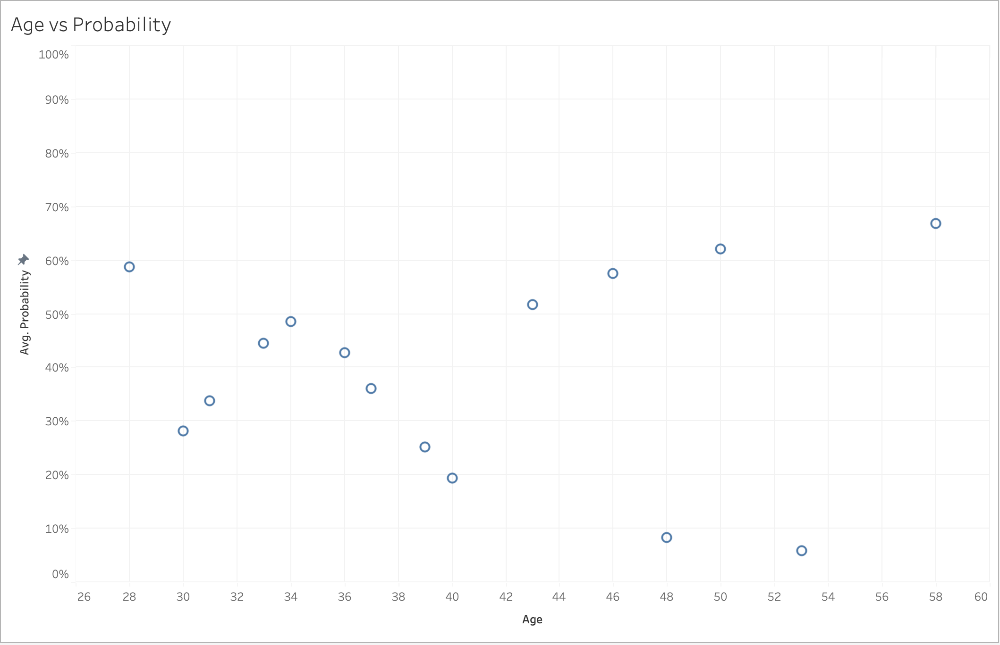
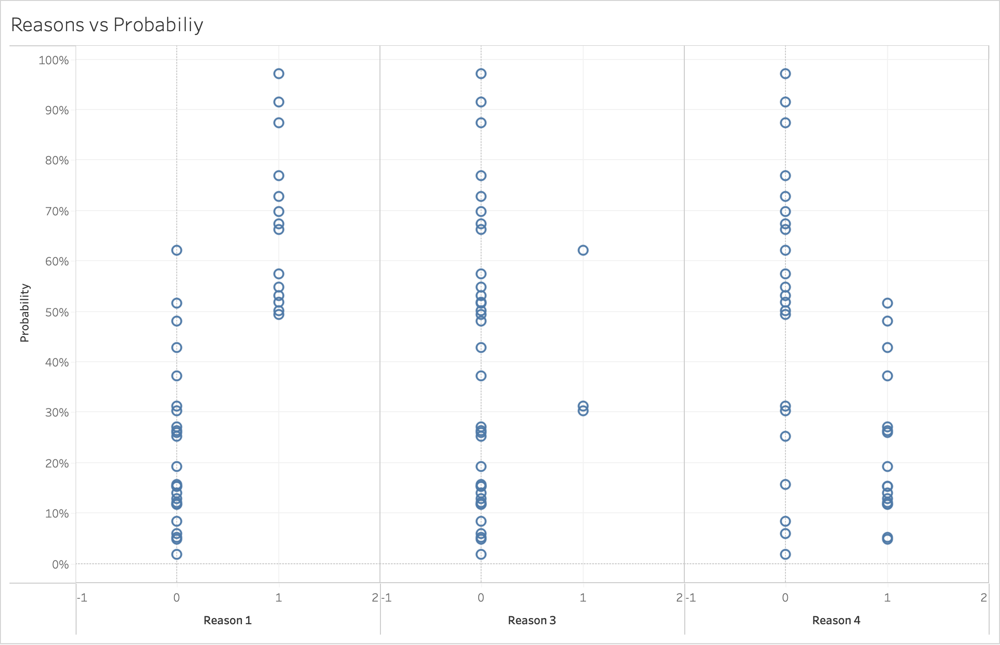
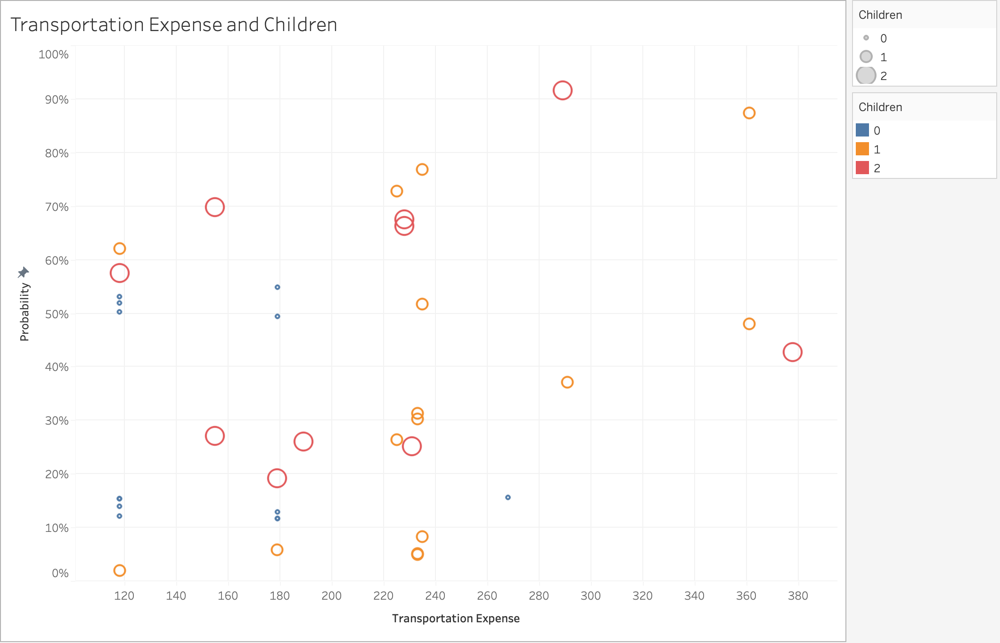

[⏪ Back](./)

# [Data Story: Predicting Absenteeism from Work](./Absenteeism_Final.ipynb)

### Introduction

Workplace absenteeism is a significant concern for organizations, affecting productivity and overall efficiency. In this project, we aim to explore whether specific known reasons for absence can predict excessive absenteeism from work. The analysis involves preprocessing data, exploring key features, and building a predictive model using logistic regression.

### [Link to Notebook](./Absenteeism_Final.ipynb)
### Data Exploration

We start by loading the raw data from 'Absenteeism_data.csv' and inspecting the initial records.

The dataset includes various features such as transportation expense, distance to work, age, and the reason for absence. We focus on known reasons for absence, excluding cases with an unknown reason.

### Feature Engineering

To enhance our model, we encode the reasons for absence into binary columns, creating 'Reason_1', 'Reason_2', 'Reason_3', and 'Reason_4'. We also extract the month and weekday from the date column. Educational levels are mapped, and the dataset is preprocessed.

### Target Definition

We create a target variable, 'Excessive Absenteeism,' by classifying individuals with absenteeism time greater than the median as 1, and others as 0.

### Model Building

We scale the inputs using a custom scaler and split the dataset into training and testing sets. A logistic regression model is then trained on the data.

### Model Evaluation

We evaluate the model's performance on the test set and analyze the coefficients to understand the impact of each feature.

### Predictions

We create an Absenteeism Model class for easy loading, cleaning, and making predictions. The model is applied to new data from 'Absenteeism_new_data.csv,' and the predictions are saved.

### Conclusion

Some of the key learnings from this project were:
**Age:**  
Individuals below the age of 40 exhibit an average probability of experiencing excessive absenteeism of less than 50%. Notably, there is only a 28% chance that a person aged 30 would be excessively absent, emphasizing a decreasing trend in absenteeism probability with decreasing age.

**Reasons:**  
Employees citing Reason 1, associated with very serious diseases, demonstrate a higher likelihood of being excessively absent. Conversely, Reason 3 reveals very few observations, limiting its informative value regarding excessive absenteeism. Those attributing their absence to Reason 4, encompassing lighter reasons like dental appointments and physiotherapy, are less likely to experience excessive absenteeism.

**Transportation Expense and Children:**  
Individuals without children do not show a significant probability of excessive absenteeism, possibly influenced by their lower transportation expenses, indicative of a potential inclination to reside closer to their workplace. Among those with one child, most exhibit an average transportation expense falling between 220-240 per month, with the majority having transportation expenses below 240 per month. This suggests a nuanced relationship between the number of children and transportation expenses concerning absenteeism probability.

This project provides insights into absenteeism prediction using logistic regression. The model can be a valuable tool for organizations to identify potential excessive absenteeism and take proactive measures.

By leveraging known reasons for absence, the model contributes to a more informed and data-driven approach to workforce management. Further refinements and extensions of the model can enhance its predictive power, supporting better decision-making in the workplace

[⏪ Back](./)
